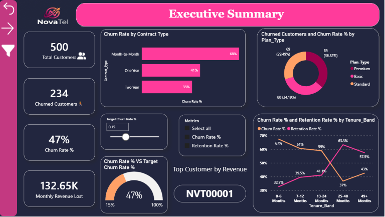
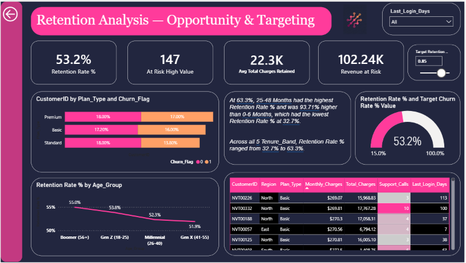
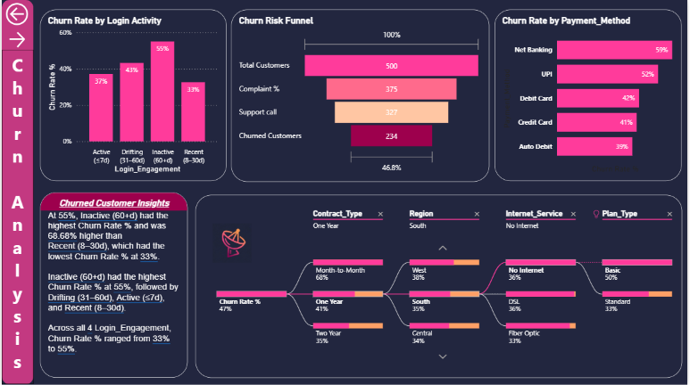
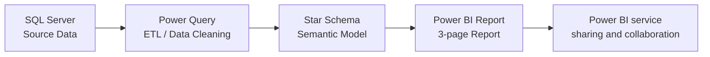

# Churn_Analysis-Power_Bi-Project
# NovaTel Customer Churn Analysis

Interactive Power BI dashboard analyzing customer churn for a fictional telecom company (NovaTel), built to identify at-risk customers, quantify revenue impact, and give retention teams a prioritized, data-driven action plan.

---

## Overview

NovaTel was losing **47% of its customer base** — more than 3x its internal 13% churn target — costing an estimated **$132.65K in monthly revenue**. This project builds an end-to-end analytics solution that:

- Quantifies the size and cost of the churn problem for executives
- Identifies the highest-value at-risk customers for prioritized retention outreach
- Diagnoses the behavioral and contractual drivers behind churn
- Gives stakeholders self-service tools (what-if parameters, dynamic metric switching, drill-down) instead of a static snapshot

**[View the stakeholder presentation deck](NovaTel_Churn_Stakeholder_Insights.pdf)**

---

## Dashboard Preview

| Executive Summary | Retention Analysis | Churn Diagnostics |
|---|---|---|
|  |  |  |

---

## Business Problem

Telecom companies operate on subscription revenue, so customer churn directly erodes recurring revenue. NovaTel needed to answer three questions:

1. **How bad is the problem, and where is it concentrated?** (Executive view)
2. **Which specific customers should we save first, and what's it worth?** (Retention/targeting view)
3. **Why are customers churning, and can we predict it before it happens?** (Diagnostic view)

This dashboard is structured as three report pages, each answering one of these questions for a different stakeholder audience.

---

## Key Insights

| Finding | Detail |
|---|---|
| **Contract type drives churn** | Month-to-Month customers churn at 68% vs. 35% for Two-Year contracts |
| **Early lifecycle is highest risk** | 0-6 month customers retain at only 32.7% — the weakest of any tenure band — vs. 63.3% for 25-48 month customers |
| **Churn gives warning signs** | Customers inactive for 60+ days churn at 55%, the highest of any engagement segment |
| **Support interactions are a tipping point** | 46.8% of customers who raise a complaint or place a support call go on to churn |
| **Payment method correlates with churn** | Net Banking (58%) and UPI (52%) users churn well above card-based auto-pay users (39-42%) |
| **147 high-value customers are at risk**| Representing **$102.24K** in revenue that prioritized outreach could protect |

---

## Tech Stack & Architecture

- **Source:** SQL Server (customer, contract, payment, and usage data)
- **ETL:** Power Query — data typing, cleaning, and conditional column logic (10 queries)
- **Modeling:** Star schema — `Fact_CustomerChum` linked to `Dim_Contract`, `Dim_Payment`, `Dim_Region`, `Dim_Tenure`, plus a centralized `Measures_Table` and What-If parameter tables for dynamic targets
- **Governance:** `User_region_Map` table designed to support Row-Level Security (RLS) by region
- **Reporting:** Power BI Desktop, saved in **PBIP** (Power BI Project) format for Git-based version control

Full data model details: [`docs/DATA_DICTIONARY.md`](docs/DATA_DICTIONARY.md)
Key DAX measures: [`docs/DAX_MEASURES.md`](docs/DAX_MEASURES.md)

---

## Dashboard Features

- **Executive Summary** — headline KPIs, churn rate by contract/plan type, target-vs-actual gauge, tenure-band trend
- **Retention Analysis** — at-risk high-value customer list, revenue-at-risk quantification, retention by age group
- **Churn Analysis** — login-activity and payment-method churn drivers, a churn risk funnel, and an interactive decomposition tree for ad-hoc root-cause drill-down
- **Self-service controls** — What-If target sliders for churn/retention goals, a dynamic Field Parameter metric selector, and global slicers (Region, Contract Type, Plan Type, Last Login)

---

## Roadmap

- [ ] Predictive churn scoring using Power BI Key Influencers / a logistic regression model
- [ ] Customer Lifetime Value (CLV) vs. cost-to-retain comparison for ROI-based prioritization
- [ ] Month-over-month churn trend tracking with automated alerting
- [ ] Full Row-Level Security implementation and testing across regional roles

---

## Author

**[Kokilavani]**
Data Analyst | Power BI · SQL · DAX
[LinkedIn](#) · [Portfolio](#) · [Kokilavani697@gmail.com](#)

---

## License

This project is licensed under the MIT License — see [LICENSE](LICENSE) for details. The dataset used is synthetic/sample data created for portfolio and educational purposes only.
